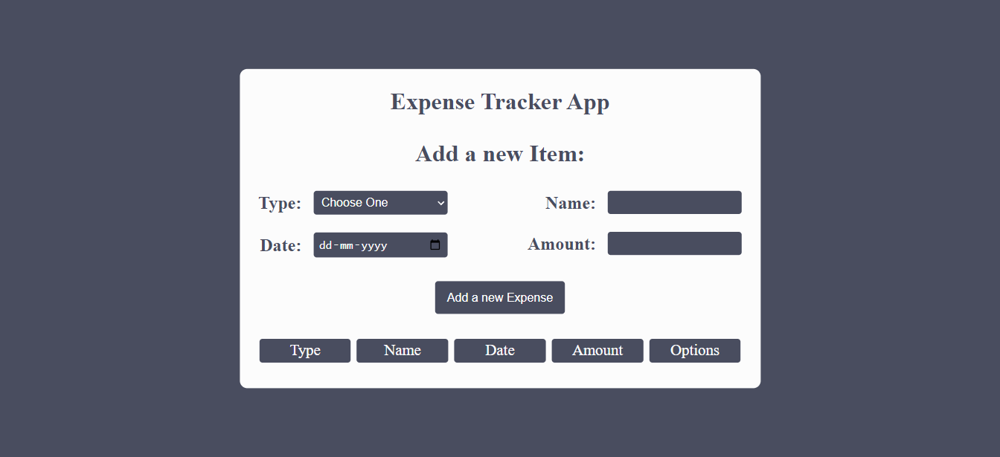
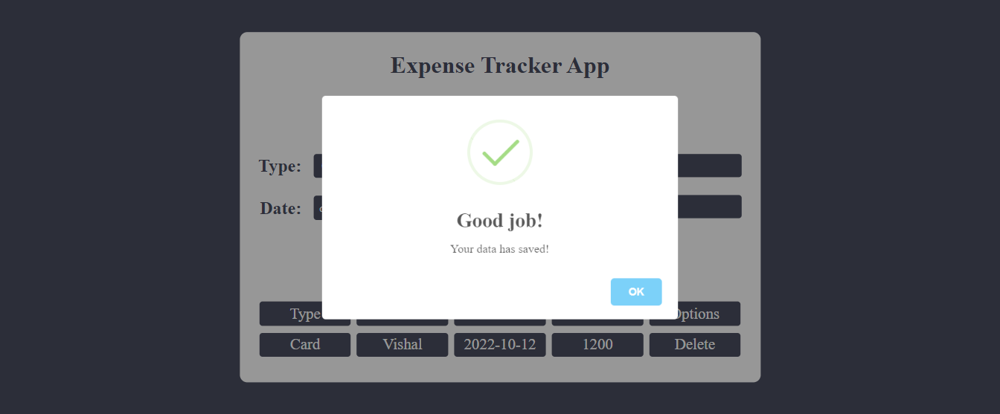
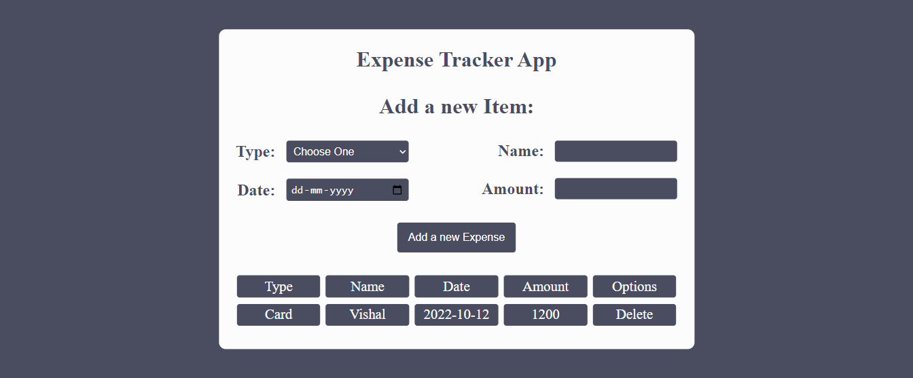
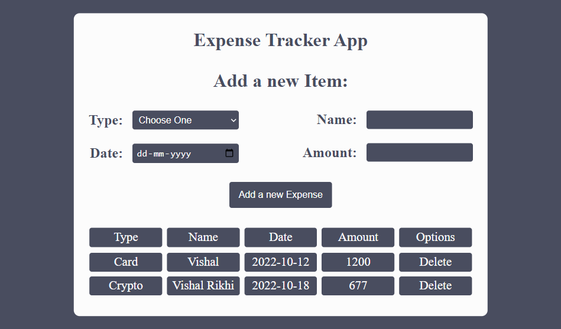

## 🔗 Expense-Tracker
[https://vishal-expense-tracker.netlify.app/](https://vishal-expense-tracker.netlify.app/)

## ⭐ Expense-Tracker ⭐

This is the assignment given in the **"JavaScript Full Stack Web Developer Bootcamp"** by **iNeuron** *&* This Assignment was done using **HTML5, CSS3 & Vanilla JavaScript.**

### 📌 Tech Stack

&nbsp; &nbsp; 

### 📌 Overview 

  
  
  
  

### 📌 What I Learn

> 👉 1. Html, Css and DOM manipulation.  
  👉 2. Seprating the functionality into smaller chunks.  
  👉 3. Managing Objects, Handling Event Listeners.  
  👉 4. Loops and conditionals.  
  👉 5. Sweet Alert Plugin.  
  👉 6. String method manipulations.  
  👉 7. Local Storage.  

### Time Taken to Complete this Project:- 6 Hours

### 📬 Connect With Me

- **LinkedIn** - [Vishal Rikhi](https://www.linkedin.com/in/vishal-rikhi/)

### 📌 Acknowledgement

- **Course Instructor** - [Hitesh Choudhary](https://www.linkedin.com/in/hiteshchoudhary/)

